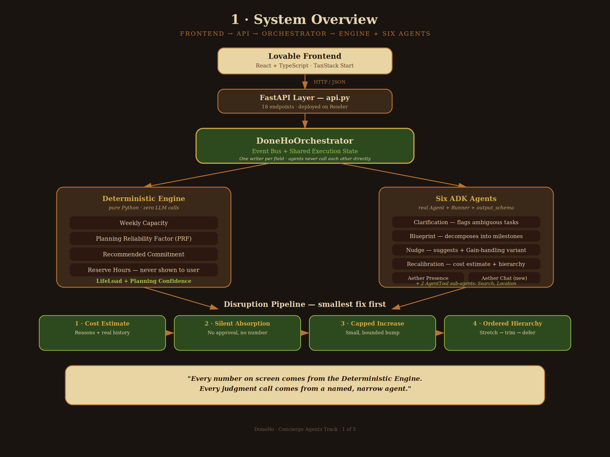

# DoneHo

**Plans that bend so you don't break.**

An adaptive weekly planner built on Google ADK. A missed task doesn't mean a failed week.

---

## Try It

**Live app:** https://doneho-magic-builder.lovable.app
**Backend API:** https://doneho-api.onrender.com

No signup required — any email format works (e.g. `test@test.com`); no real account is created.

**Before you try it, three things worth knowing:**

- **First request may be slow (30-50s).** The backend sleeps after ~15 min idle (free-tier hosting). This is a hosting quirk, not a bug — it wakes up fine after that.
- **If any single action fails once, just retry it.** Occasional `502`s come from either a cold start or a transient upstream Gemini overload — both resolve on a second try, confirmed repeatedly during testing.
- **When asked about caregiving/planned-event hours, answer in exact "X hours per week" phrasing.** The current parser extracts the first number in your reply without unit-checking — see [ARCHITECTURE.md](./ARCHITECTURE.md) for the known gap.

## Judges: If the Live Link Doesn't Work

Use the repo instead — this is explicitly permitted per the competition rules, provided setup is documented. It is, below.

```
git clone https://github.com/thasli-dot/doneho-backend.git
cd doneho-backend
python -m venv venv
source venv/bin/activate          # Windows: venv\Scripts\activate
pip install -r requirements.txt
cp .env.example .env              # add your own GOOGLE_API_KEY
python main.py                   # runs a full, real, end-to-end demo
```

**What `main.py` proves, in order:** goal clarification → real Blueprint with concrete milestones → a disruption reported and calmly absorbed, no guilt language → "Life Happened" triggered → a second, similar disruption showing real per-user pattern learning. No mock data — the same backend the live app calls.

**To check the agents are actually correct, not just running:**
```bash
python evals/run_evals.py
```
This checks real agent output against concrete pass/fail criteria — no generic milestone titles, sane disruption cost estimates, every numeric claim paired with a justification. `main.py` shows the agents ran; this shows whether they ran *correctly*.

## The Problem

Every planner bets your week goes as planned. It won't.

Over five years running an EdTech venture for India's toughest exam, one pattern repeated: people didn't fail from lack of ambition. They failed the moment their plan couldn't survive a bad day. 15 interviews, 6 segments, same result every time.

## The Solution

1. **Functional recovery, not perfect recovery.** DoneHo absorbs what it can, asks before anything bigger, never collapses the week.
2. **Math and AI, kept separate.** Anything calculable is calculated by code, never guessed by a model. Anything needing judgment goes to a named, narrow agent.

## Architecture, at a Glance



- **Deterministic Engine** — pure Python, zero LLM calls: Capacity, Reserve Hours, LifeLoad.
- **Six ADK Agents** — real reasoning: Clarification, Blueprint, Nudge, Recalibration, Aether Presence, Aether Chat.
- **18 live endpoints**, deployed on Render, called by the real frontend — not a mockup.

Full technical depth — every endpoint, every schema field, exactly what's wired vs. simulated — lives in **[ARCHITECTURE.md](./ARCHITECTURE.md)**, not repeated here.

## The One Rule That Holds Everything Together

Every piece of shared state has exactly one owner, enforced at runtime, not convention. A wrong-owner write raises an error immediately — no silent overwrites between agents.

## Repos

- **Backend:** github.com/thasli-dot/doneho-backend (this repo)
- **Frontend:** github.com/thasli-dot/doneho-builder

## Tech Stack

Python · FastAPI · Google ADK · Gemini · Render (backend hosting) · React · TypeScript · TanStack Start · Lovable (frontend hosting)
